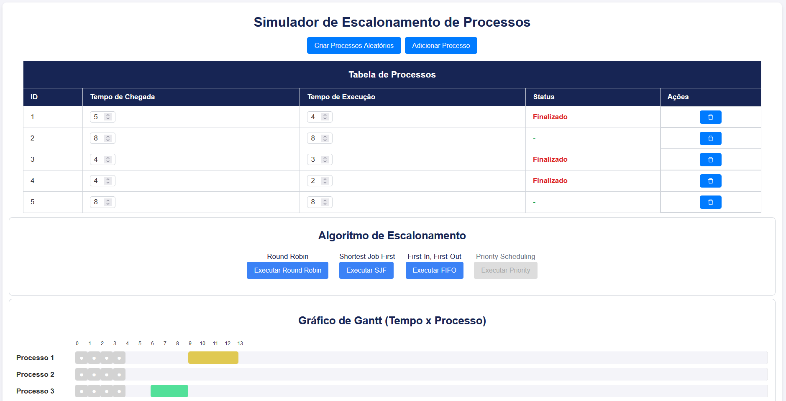

# Simulação de Escalonamento de Processos

Este projeto é uma aplicação web desenvolvida em React que simula algoritmos de escalonamento de processos em sistemas operacionais: **Round Robin**, **Shortest Job First (SJF)**, **First-In, First-Out (FIFO)** e **Priority Scheduling**. A aplicação permite a criação e manipulação de processos, visualização do gráfico de Gantt e análise dos tempos de execução.



### Round Robin
O escalonamento de processos Round Robin funciona atribuindo um tempo fixo (quantum) a cada processo. Quando o tempo de um processo expira, o sistema operacional o coloca no final da fila, dando oportunidade para o próximo processo na fila. Isso garante que todos os processos recebam tempo de CPU de forma justa.

### Shortest Job First (SJF)
O escalonamento Shortest Job First (SJF) prioriza os processos com menor tempo de execução. O processo mais curto é executado primeiro, o que minimiza o tempo de espera médio. Contudo, pode causar adiamento de processos mais longos, especialmente se novos processos curtos continuarem chegando. Isso leva ao que chamamos de "starvation", onde processos longos não recebem a chance de serem executados rapidamente.

### First-In, First-Out (FIFO)
O escalonamento First In, First Out (FIFO) executa os processos na ordem de chegada. O primeiro processo a entrar na fila é o primeiro a ser executado, e assim por diante. Isso é simples e justo, mas pode levar a tempos de espera elevados se um processo longo chegar primeiro.

### Priority Scheduling
O escalonamento por Prioridade (Priority Scheduling) atribui a cada processo uma prioridade. Processos com maior prioridade são executados antes dos processos com menor prioridade. Se dois processos têm a mesma prioridade, pode-se usar outro método de escalonamento para decidir a ordem. Essa abordagem é útil para garantir que processos críticos sejam atendidos rapidamente, mas pode causar "starvation" de processos com prioridade baixa.

## Funcionalidades

- **Criar Processos Aleatórios**: Gera entre 3 a 6 processos aleatórios, com tempo de chegada e execução variando de 1 a 8.
- **Simulação de Algoritmos**: Executa as simulações de escalonamento usando os algoritmos Round Robin e SJF.
- **Gráfico de Gantt**: Exibe o tempo de execução de cada processo em um gráfico de Gantt.
- **Edição de Processos**: Permite editar os tempos de chegada, execução e restante dos processos.

## Tecnologias Utilizadas

- React
- CSS
- JavaScript

## Instalação

1. Clone o repositório:

   ```bash
   git clone https://github.com/SidneyRMR/simulador-escalonamento
   ```

2. Navegue até o diretório do projeto:

   ```bash
   cd simulador-escalonamento
   ```

3. Instale as dependências:

   ```bash
   npm install
   ```

4. Inicie a aplicação:

   ```bash
   npm start
   ```

5. Abra seu navegador e acesse `http://localhost:3000`.

## Uso

- Crie processos aleatórios clicando no botão "Criar Processos Aleatórios".
- Edite os tempos de chegada e execução dos processos, se necessário.
- Escolha um algoritmo de escalonamento (Round Robin ou SJF) e clique no botão correspondente para iniciar a simulação.
- O gráfico de Gantt será atualizado em tempo real, mostrando a execução de cada processo.

## Contribuição

- `https://github.com/brendagaudencio`
- `https://github.com/renan-mazzilli`
- `https://github.com/thaitoGB`

## Licença

Este projeto é licenciado sob a [MIT License](LICENSE).
